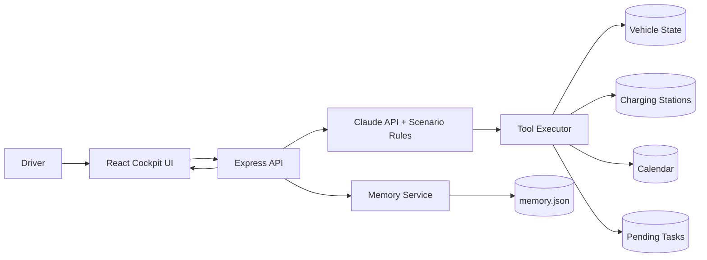

# ChargeFlow Agent

> 基于 LLM 的智能座舱补能决策 Agent，支持场景推理、多工具编排、跨会话记忆。  
> An LLM-based intelligent cockpit charging agent with scenario reasoning, multi-tool orchestration, and cross-session memory.

ChargeFlow Agent 基于"找到附近最快能充上电并监控车辆电量"的电量管理app，升级为一个能感知**电量状态、当前任务、未来行程、跨时段记忆**的企业级座舱任务管家。项目展示了从产品场景建模、Prompt Engineering、Function Calling 设计到 React + Express 原型开发的完整闭环。

---

## 1. 核心场景 / Core Scenarios

### 场景 A：无目的地 — 主动补能
用户说：`帮我看看现在电量够不够用`

- Agent 获取车辆状态：SOC 18%，续航 62km
- 无导航目的地，无紧急日程
- 自动搜索附近充电站，按距离/功率/空闲桩位排序
- 推荐最优站点并创建充电计划

### 场景 B：导航途中 — 保障当前行程
用户说：`我正在去浦东开会，电量够吗？`

- Agent 判断续航 vs 目的地距离
- 若够用：不中断导航，提示最晚补能截止点
- 若不够：立即推荐途中充电站

### 场景 C：有后续日程 — 预判未来出行
用户说：`后天要去浦东机场接人，需要提前充电吗？`

- Agent 查日历：机场接机往返 ~70km，当前续航 62km
- 计算最晚补能时间
- 建议在空闲时段提前充电

### 场景 D：跨会话续接 — 延续未完成任务
用户说：`上次的充电建议还在吗？`

- Agent 读取上次未执行的充电任务
- 重新评估当前电量、站点状态
- 展示更新后的推荐

---

## 2. 技术架构图 / Architecture Diagram



---

## 3. 核心设计亮点 / Core Design Highlights

- **场景决策引擎**：四大场景覆盖从"无事可做"到"正在赶路"的完整状态空间，Agent 按优先级组合调用多个工具
- **多工具编排**：5 个工具（vehicle_status / search_stations / calendar / pending_tasks / charge_plan）通过标准 `tool_use` schema 协同工作
- **分层 Prompt**：角色定义 → 场景规则 → 工具说明 → 记忆注入 → 输出约束，五层结构引导 LLM 做出合理决策
- **跨会话记忆**：驾驶偏好持久化为 JSON，未完成任务自动在下次会话中恢复
- **车辆状态仪表盘**：前端实时展示 SOC、续航、导航状态、工具调用链路

---

## 4. 快速启动 / Quick Start

```bash
git clone https://github.com/ChloeXue00/chargeflow-agent.git
cd chargeflow-agent
npm install
cp .env.example .env
# 在 .env 中填入 ANTHROPIC_API_KEY（可选，不填则进入 mock mode）

npm run dev:server
npm run dev:client
```

也可以先 build 再启动：

```bash
npm run build
npm start
```

- 前端 / Frontend: <http://localhost:5173>
- 后端 / Backend: <http://localhost:3001>

说明：后端是纯 API 服务，直接访问根路径 `/` 会显示 `Cannot GET /`，这是正常现象。

---

## 5. 产品文档 / Product Documentation
- [PRD](./docs/PRD.md)
- [Architecture](./docs/architecture.md)
- [Prompt Design](./docs/prompt-design.md)
- [English README](./README_EN.md)

---

## 6. 项目结构 / Project Structure

```text
chargeflow-agent/
├── README.md
├── README_EN.md
├── docs/
│   ├── PRD.md
│   ├── architecture.md
│   └── prompt-design.md
├── client/
│   ├── src/
│   │   ├── App.jsx
│   │   ├── components/
│   │   │   ├── ChatWindow.jsx
│   │   │   ├── MessageBubble.jsx
│   │   │   ├── ToolCallDisplay.jsx
│   │   │   ├── MemoryPanel.jsx
│   │   │   └── VehicleStatus.jsx
│   │   ├── hooks/
│   │   │   └── useChat.js
│   │   └── utils/
│   │       └── api.js
│   └── package.json
├── server/
│   ├── index.js
│   ├── routes/
│   │   └── chat.js
│   ├── services/
│   │   ├── llm.js
│   │   ├── tools.js
│   │   └── memory.js
│   ├── data/
│   │   ├── vehicle_state.json
│   │   ├── charging_stations.json
│   │   ├── calendar.json
│   │   ├── pending_tasks.json
│   │   └── memory.json
│   └── package.json
├── .env.example
├── .gitignore
└── LICENSE
```


