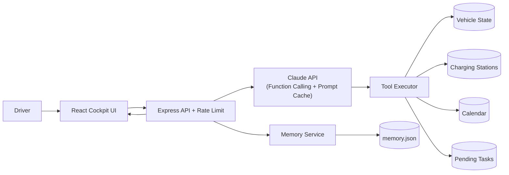

<div align="center">

# ⚡ ChargeFlow Agent

**基于 LLM 的智能座舱补能决策 Agent —— 场景推理 · 多工具编排 · 跨会话记忆**
_An LLM-powered intelligent EV cockpit agent: scenario reasoning, multi-tool orchestration & cross-session memory._

[](https://github.com/ChloeXue00/chargeflow-agent/actions/workflows/ci.yml)
[](https://chargeflow-agent-client.vercel.app)


🔗 **Live Demo:** https://chargeflow-agent-client.vercel.app · 📄 [PRD](./docs/PRD.md) · 🏗️ [Architecture](./docs/architecture.md) · 🧠 [Prompt Design](./docs/prompt-design.md) · 🇬🇧 [English](./README_EN.md)

</div>

ChargeFlow Agent 把一个"找附近充电站"的工具型 app，升级为能感知 **电量状态、当前任务、未来行程、跨时段记忆** 的企业级座舱任务管家。它展示了一个 AI Agent 的完整工程闭环:**产品场景建模 → 分层 Prompt Engineering → Anthropic Function Calling → 多工具编排 → 持久化记忆 → React 可视化前端**。


> 界面同时呈现了驾驶者最关心的四件事:**车辆状态仪表盘**、**对话式补能助手**、**工具调用链路(决策可解释)**、**跨会话记忆**。

---

## ✨ 工程亮点 / Engineering Highlights

| 能力 | 实现 |
| --- | --- |
| **真实 Function Calling** | 基于 `@anthropic-ai/sdk` 的标准 `tool_use` 协议,支持**多步工具链**(获取车况 → 搜站 → 查日历 → 生成计划)的 agent loop |
| **场景决策引擎** | 4 大场景覆盖从"无事可做"到"正在赶路"的完整状态空间,按**优先级(安全优先)**组合调用工具 |
| **分层 System Prompt** | 角色 → 场景规则 → 工具 → 记忆 → 输出约束,五层结构引导稳定决策 |
| **Prompt Caching** | 静态 system prompt 通过 `cache_control` 缓存,记忆作为独立块注入,使大前缀稳定命中缓存,**输入成本降低 ~90%、首字延迟更低** |
| **跨会话记忆** | 驾驶偏好与未完成任务持久化为 JSON,下次会话自动恢复并重新评估 |
| **可安全公开部署** | `/api/chat` 加滑动窗口**限流**、请求体积与对话长度上限,保护真实 API key 不被刷量 |
| **真实数据(可选)** | 配置 `AMAP_WEB_KEY` 即用**高德 POI 周边搜索**返回真实附近充电站;未配置自动回退 mock,demo 零配置可跑 |
| **CI** | GitHub Actions 在 Node 20/22 矩阵上 lint + build,徽章实时反映健康度 |

---

## 📱 一个大脑,两个表面 / One Brain, Two Surfaces

同一套 **Express + Claude Agent 后端**,两个前端表面 —— 复用 `useChat` 与 `/api`:

| 表面 | 路由 | 形态 | 用途 |
| --- | --- | --- | --- |
| **车机座舱** | [`/`](https://chargeflow-agent-client.vercel.app) | 横屏仪表盘 | 产品**最终嵌入车机**形态(招聘方演示) |
| **移动小程序** | [`/m`](https://chargeflow-agent-client.vercel.app/m) | 手机竖屏 · **PWA 可安装** | 获客 / **拉用户内测验证需求** |

移动端照原始 [Figma 设计](./docs/DESIGN.md)的青绿视觉语言还原,并把"找桩工具"升级为对话式 Agent:

<p align="center">
  
  
  
</p>

> 📐 完整「设计稿 → 实现」对照与产品演进思考见 **[docs/DESIGN.md](./docs/DESIGN.md)**。

---

## 🎬 核心场景 / Core Scenarios

### 场景 A：无目的地 — 主动补能
> 用户:`帮我看看现在电量够不够用`

Agent 获取车辆状态(SOC 18% / 续航 62km)→ 判断无导航无日程 → 搜索附近充电站并按距离/功率/空闲桩排序 → 推荐最优站点。


### 场景 B：导航途中 — 保障当前行程
> 用户:`我正在去浦东开会，电量够吗？`

判断续航 vs 目的地距离:够用则不打断导航、只给出最晚补能截止点;不够则立即推荐途中充电站。

### 场景 C：有后续日程 — 预判未来出行
> 用户:`后天要去浦东机场接人，电量够吗？`

读取日历(机场往返 ~70km vs 当前续航 62km)→ 计算最晚补能时间 → 建议在空闲时段提前充电。


### 场景 D：跨会话续接 — 延续未完成任务
> 用户:`上次的充电建议还在吗？`

读取上次未执行的充电任务 → 重新评估当前电量与站点状态 → 展示更新后的推荐。


---

## 🏗️ 技术架构 / Architecture



**Agent loop**:`runAgentTurn` 注入记忆 → 调 Claude → 执行返回的 `tool_use` 块(支持多步)→ 把 `tool_result` 回灌生成最终答复 → 抽取并持久化记忆候选。详见 [`server/services/llm.js`](./server/services/llm.js)。

**技术栈**:React 19 · Vite 7 · Tailwind 4 · Express 4 · Anthropic SDK · Zod · GitHub Actions。

---

## 🚀 快速启动 / Quick Start

```bash
git clone https://github.com/ChloeXue00/chargeflow-agent.git
cd chargeflow-agent
npm install                      # 安装 client + server 全部依赖 (npm workspaces)
cp .env.example .env             # 可选:在 .env 填入 ANTHROPIC_API_KEY

npm run dev:server               # 后端  → http://localhost:3001
npm run dev:client               # 前端  → http://localhost:5173
```

- 车机座舱版 / Cockpit: <http://localhost:5173>
- 移动小程序版 / Mobile (PWA): <http://localhost:5173/m>

> 💡 **无需 API key 也能完整演示**:未配置 `ANTHROPIC_API_KEY` 时,Agent 自动进入 **mock 模式**,UI、工具调用链路与记忆面板全部可用。填入 key 即切换到真实 Claude 推理。

线上一键部署见 👉 [`DEPLOY.md`](./DEPLOY.md) —— **全栈上 Vercel**(前端 + Serverless API 同项目同域,免绑卡)。

---

## 📂 项目结构 / Project Structure

```text
chargeflow-agent/
├── client/                      # React 19 + Vite + Tailwind 前端
│   ├── public/                  # PWA: manifest.webmanifest · sw.js · icons/
│   └── src/
│       ├── main.jsx             # 路由: / = 座舱, /m = 移动端
│       ├── App.jsx              # 车机座舱版 (横屏)
│       ├── mobile/              # 移动小程序版 (竖屏, Figma 视觉还原)
│       ├── components/          # VehicleStatus / ChatWindow / ToolCallDisplay / MemoryPanel ...
│       ├── hooks/useChat.js     # 共享数据层 (两个表面复用)
│       └── utils/api.js
├── server/                      # Express API
│   ├── index.js                 # CORS / 限流 / 路由
│   ├── routes/chat.js           # 对话端点 + 输入校验
│   ├── middleware/rateLimit.js  # 无依赖滑动窗口限流
│   ├── services/
│   │   ├── llm.js               # Agent loop · Function Calling · Prompt Cache
│   │   ├── tools.js             # 5 个工具的 schema 与执行器
│   │   └── memory.js            # 跨会话记忆抽取与持久化
│   └── data/                    # 车况 / 充电站 / 日历 / 任务 / 记忆 (mock 数据)
├── api/index.mjs                # Vercel Serverless 入口 (包装 Express app)
├── docs/                        # PRD · architecture · prompt-design · DESIGN · figma · screenshots
├── vercel.json                  # 全栈部署 (静态前端 + Serverless API)
└── .github/workflows/ci.yml     # CI: lint + build (Node 20/22)
```

---

## 📖 文档 / Documentation
- [产品需求 PRD](./docs/PRD.md)
- [架构设计 Architecture](./docs/architecture.md)
- [Prompt 设计 Prompt Design](./docs/prompt-design.md)
- [🎨 设计 → 实现 Design to Implementation](./docs/DESIGN.md)
- [交互原型 Figma Prototype](https://www.figma.com/proto/Lx9zKvPVRtMMtm7VvqeoWR/%E7%94%B5%E5%8A%A8%E8%BD%A6%E6%99%BA%E8%83%BD%E5%85%85%E7%94%B5%E5%B0%8F%E7%A8%8B%E5%BA%8F?node-id=105-758)
- [部署指南 Deploy Guide](./DEPLOY.md)
- [English README](./README_EN.md)

## 📜 License
[MIT](./LICENSE)
