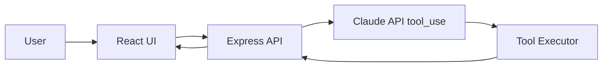

# ChargeFlow Agent

> 基于 LLM 的个人助手 Agent，支持意图推理、工具调用、跨会话记忆。  
> An LLM-based personal assistant agent with intent reasoning, tool calling, and cross-session memory.

ChargeFlow Agent AI Agent 项目展示了从产品定义、Prompt Engineering、Function Calling 设计到 React + Express 原型开发的完整闭环。  
ChargeFlow Agent showcases the full journey from product definition and prompt engineering to function-calling architecture and full-stack prototyping.

---

## 1. 项目简介 / Project Overview
这是一个基于 Anthropic Claude Messages API 的个人助手 Agent，支持自然语言对话、日历工具调用、知识检索和跨会话记忆。即使没有真实 API Key，项目也能在 mock mode 下完整演示核心架构。  
This is a personal AI assistant built on the Anthropic Claude Messages API. It supports natural language chat, calendar tool calling, note retrieval, and cross-session memory. Even without a real API key, the project can still run in mock mode to demonstrate the full architecture.

---

## 2. 功能演示 / Demo Scenarios

### 场景 1：查询日历 / Scenario 1: Calendar Lookup
用户说：`帮我看看明天有什么安排`  
User says: `Help me check what I have tomorrow.`

- Agent 识别为查询型意图 / The agent recognizes a lookup intent
- 调用 `get_calendar_events` / Calls `get_calendar_events`
- 返回结构化日历结果并总结重点 / Returns structured events and summarizes key items

### 场景 2：创建会议 / Scenario 2: Meeting Creation
用户说：`下周三下午3点帮我约一个和产品团队的会议`  
User says: `Schedule a meeting with the product team next Wednesday at 3 PM.`

- Agent 识别为创建型意图 / The agent recognizes a creation intent
- 调用 `create_calendar_event` / Calls `create_calendar_event`
- 创建 mock 日程并确认结果 / Creates a mock event and confirms the outcome

### 场景 3：长期记忆 / Scenario 3: Durable Memory
用户在多轮对话中说：`我一般周三不开会`  
User says in a prior conversation: `I usually avoid meetings on Wednesday.`

- Agent 自动提取偏好 / The agent extracts the user preference automatically
- 存入 durable memory / Stores it in durable memory
- 后续安排时主动提醒冲突 / Proactively warns about preference conflicts later

> 截图占位 / Screenshot placeholder: 后续可将运行截图放在 `docs/screenshots/` 并插入这里。  
> You can later place screenshots under `docs/screenshots/` and embed them here.

---

## 3. 技术架构图 / Architecture Diagram


---

## 4. 核心设计亮点 / Core Design Highlights
- **意图推理 / Intent Reasoning**：通过 system prompt 分层设计，引导模型区分查询 / 创建 / 闲聊意图  
  Structured prompting helps the model distinguish lookup, scheduling, and casual chat intents.
- **Function Calling**：采用标准 `tool_use` schema，支持参数校验、错误处理和统一执行入口  
  Standardized tool definitions support schema validation, error handling, and centralized execution.
- **Prompt Engineering**：使用“角色定义 → 工具说明 → 记忆注入 → 输出约束”的分层 Prompt 结构  
  The system prompt follows a layered design: role → tools → memory → constraints.
- **记忆系统 / Memory System**：会话结束后自动提取关键事实，并存入 JSON；前端 localStorage 保留聊天历史  
  Durable memory is stored in JSON, while localStorage keeps the client-side conversation experience consistent.
- **工具调用可视化 / Tool Trace Visualization**：前端实时展示工具调用输入、结果和链路  
  The UI exposes tool inputs and outputs so reviewers can directly inspect agent orchestration.

---

## 5. 快速启动 / Quick Start
```bash
git clone <your-repo-url>
cd chargeflow-agent
npm install
cp .env.example .env
# 在 .env 中填入 ANTHROPIC_API_KEY（可选，不填则进入 mock mode）
# Add ANTHROPIC_API_KEY in .env (optional; without it the app falls back to mock mode)

npm run dev:server
npm run dev:client
```

如果你想使用单一生产启动命令，也可以先 build 再启动服务端：  
If you prefer a simple production-style flow, build first and then start the server:

```bash
npm run build
npm start
```

- 前端 / Frontend: <http://localhost:5173>
- 后端 / Backend: <http://localhost:3001>

说明 / Note:
- 后端是纯 API 服务，直接访问根路径 `/` 会显示 `Cannot GET /`，这是正常现象。
- The backend is an API-only service. Visiting the root path `/` will show `Cannot GET /`, which is expected.

---

## 6. 产品文档 / Product Documentation
- [PRD](./docs/PRD.md)
- [Architecture](./docs/architecture.md)
- [Prompt Design](./docs/prompt-design.md)
- [English README](./README_EN.md)

---

## 7. 项目结构 / Project Structure
```text
chargeflow-agent/
├── README.md
├── README_EN.md
├── docs/
│   ├── PRD.md
│   ├── architecture.md
│   └── prompt-design.md
├── client/
│   ├── src/
│   │   ├── App.jsx
│   │   ├── components/
│   │   │   ├── ChatWindow.jsx
│   │   │   ├── MessageBubble.jsx
│   │   │   ├── ToolCallDisplay.jsx
│   │   │   └── MemoryPanel.jsx
│   │   ├── hooks/
│   │   │   └── useChat.js
│   │   └── utils/
│   │       └── api.js
│   └── package.json
├── server/
│   ├── index.js
│   ├── routes/
│   │   └── chat.js
│   ├── services/
│   │   ├── llm.js
│   │   ├── tools.js
│   │   └── memory.js
│   ├── data/
│   │   ├── calendar.json
│   │   ├── notes.json
│   │   └── memory.json
│   └── package.json
├── .env.example
├── .gitignore
└── LICENSE
```


## 9. 运行检查清单 / Run Checklist
- [ ] 本地跑通前后端 / Run frontend and backend locally
- [ ] 验证对话、工具调用、记忆都正常 / Verify chat, tool calls, and memory work
- [ ] 将截图放入 `docs/screenshots/` / Save screenshots into `docs/screenshots/`
- [ ] 确认 `.env` 未提交 / Make sure `.env` is not committed
- [ ] 推送到 GitHub public repo / Push to a public GitHub repository
- [ ] 把 repo 链接填到申请表 / Paste the repo link into your application form

---

## 10. 后续可扩展方向 / Future Improvements
- 接入真实 Google Calendar / Notion / Email API  
  Integrate real Google Calendar / Notion / Email APIs
- 加入用户身份与多租户隔离  
  Add authentication and multi-tenant isolation
- 把记忆提取升级成 LLM-based summarization  
  Upgrade memory extraction to LLM-based summarization
- 引入 observability、evaluation 与 replay  
  Add observability, evaluation, and replay tooling
# chargeflow-agent
