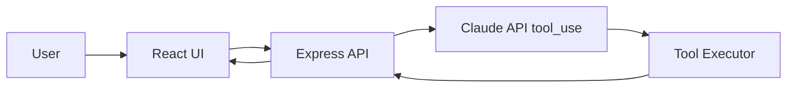

# ChargeFlow Agent

> A portfolio-ready LLM-based personal assistant agent with intent reasoning, tool calling, and cross-session memory.

ChargeFlow Agent is a full-stack AI agent showcase project built for GitHub and job applications. It demonstrates end-to-end product thinking, prompt engineering, function-calling architecture, and prototype implementation with React and Express.

## Project Overview
- React + Tailwind single-page application
- Express backend with Claude Messages API integration
- Anthropic `tool_use` compatible tool registry
- Mock calendar and notes APIs
- Durable memory backed by JSON persistence
- Frontend tool-call visualization panel

## Core Demo Scenarios
1. **Schedule lookup**: “Help me check what I have tomorrow.” → `get_calendar_events`
2. **Meeting creation**: “Schedule a meeting with the product team next Wednesday at 3 PM.” → `create_calendar_event`
3. **Memory continuity**: The agent remembers preferences like “I usually avoid meetings on Wednesday afternoons.”

## Architecture


## Quick Start
```bash
git clone <your-repo-url>
cd chargeflow-agent
npm install
cp .env.example .env
npm run dev:server
npm run dev:client
```

If `ANTHROPIC_API_KEY` is missing, the project falls back to mock mode so the demo still works.

- Frontend: <http://localhost:5173>
- Backend API: <http://localhost:3001>
- Note: the backend is an API-only service. Visiting the root path `/` will show `Cannot GET /`, which is expected.

## Documentation
- [PRD (CN)](./docs/PRD.md)
- [Architecture](./docs/architecture.md)
- [Prompt Design](./docs/prompt-design.md)

## Future Improvements
- Real calendar and note providers
- Auth and multi-user support
- Better evaluation and observability
- LLM-based memory extraction and summarization
