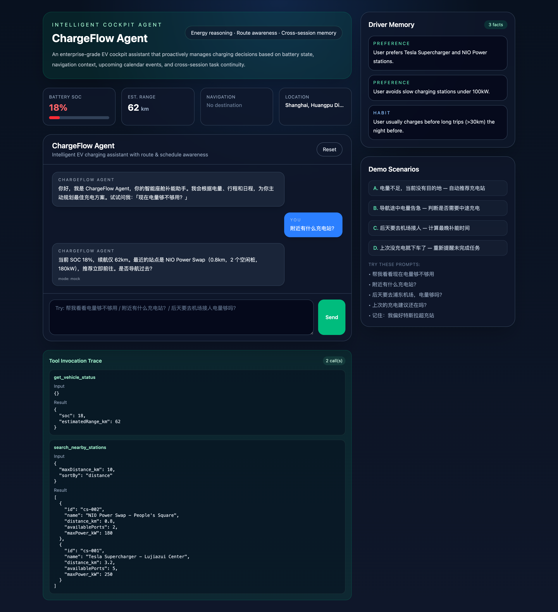
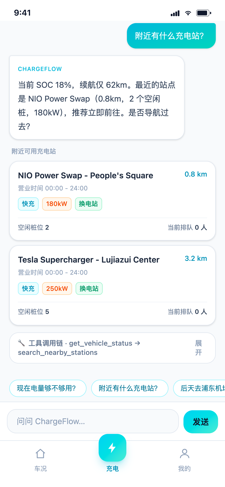
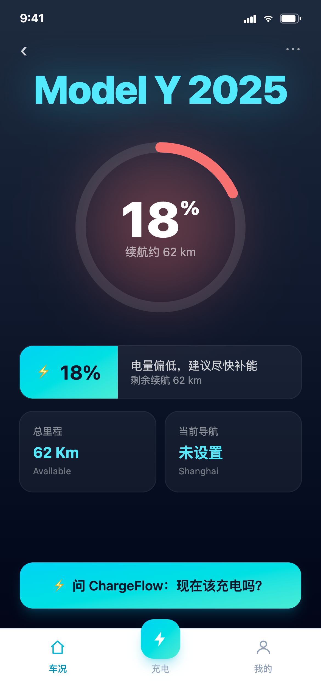
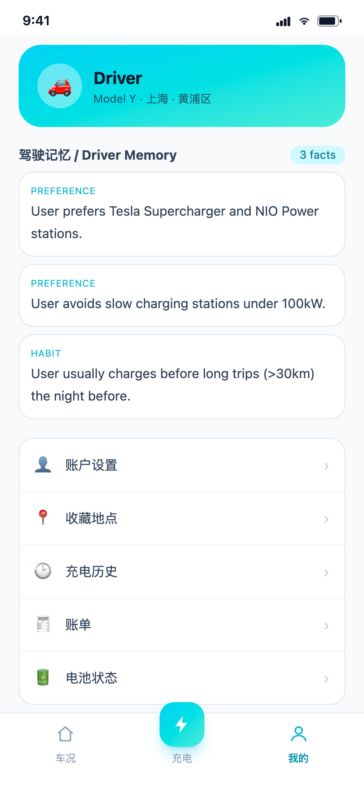
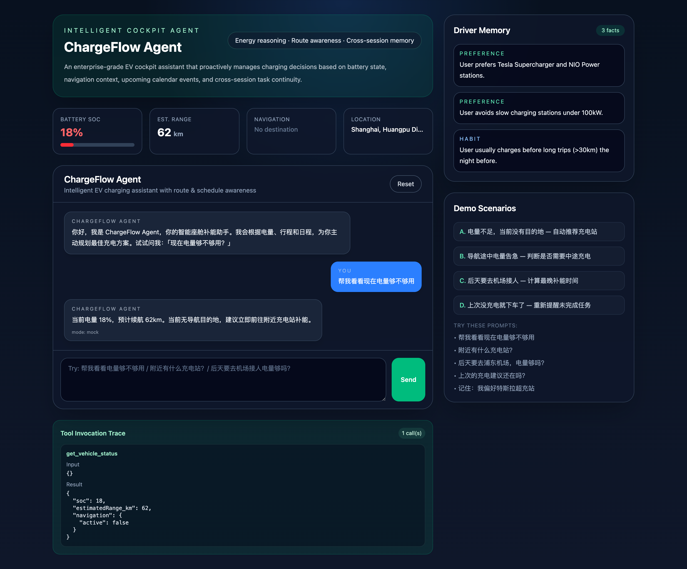
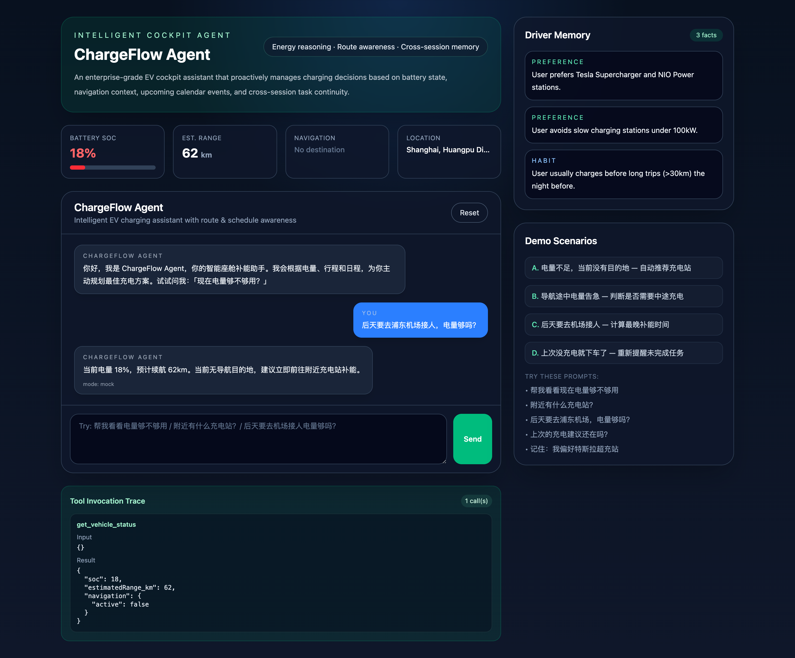
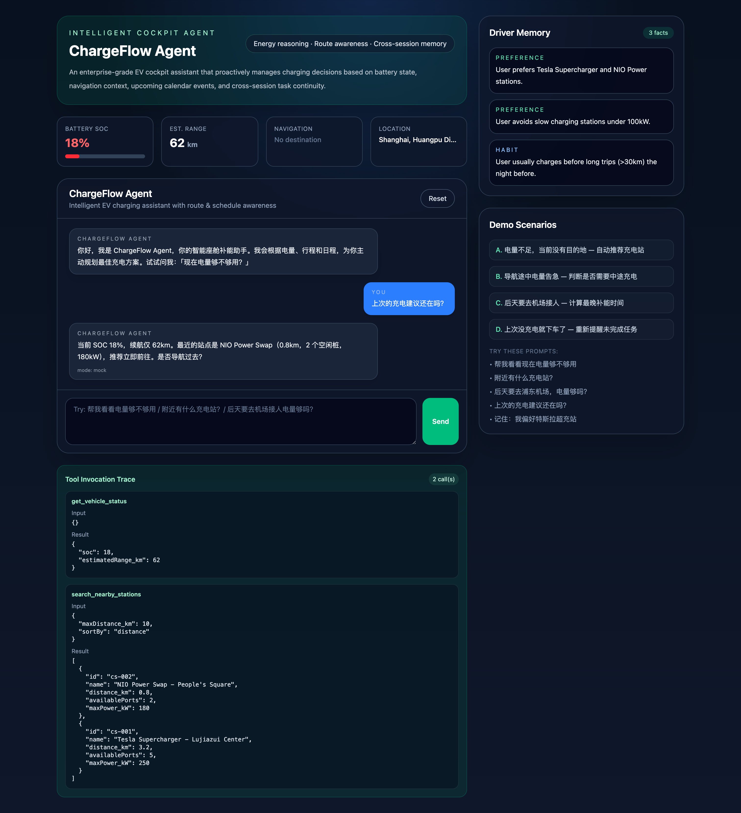
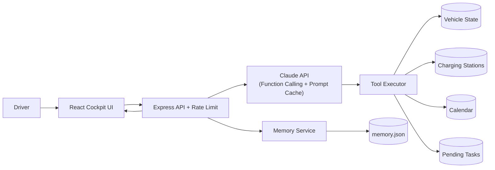

<div align="center">

# ⚡ ChargeFlow Agent

**An LLM-powered intelligent EV cockpit agent: scenario reasoning, multi-tool orchestration & cross-session memory.**

[](https://github.com/ChloeXue00/chargeflow-agent/actions/workflows/ci.yml)
[](https://chargeflow-agent-client.vercel.app)


🔗 **Live Demo:** https://chargeflow-agent-client.vercel.app · 📄 [PRD](./docs/PRD.md) · 🏗️ [Architecture](./docs/architecture.md) · 🧠 [Prompt Design](./docs/prompt-design.md) · 🇨🇳 [中文](./README.md)

</div>

ChargeFlow Agent is not a simple "low battery, find a charger" tool. It is an enterprise-grade cockpit task manager that reasons about **battery state, current trip, future schedule, and cross-session history** to make proactive charging decisions. It demonstrates the full engineering loop of an AI agent: **product scenario modeling → layered prompt engineering → Anthropic function calling → multi-tool orchestration → durable memory → a React visualization frontend.**



> The UI surfaces the four things a driver cares about: **vehicle dashboard**, **conversational assistant**, **tool-call trace (explainable decisions)**, and **cross-session memory**.

---

## ✨ Engineering Highlights

| Capability | Implementation |
| --- | --- |
| **Real function calling** | Standard `tool_use` protocol via `@anthropic-ai/sdk`, with a **multi-step agent loop** (get vehicle → search stations → check calendar → create plan) |
| **Scenario decision engine** | Four scenarios cover the full state space from "idle" to "mid-trip", with **priority-ordered (safety-first)** tool orchestration |
| **Layered system prompt** | role → scenario rules → tools → memory → constraints, for stable structured decisions |
| **Prompt caching** | The static system prompt is marked with `cache_control`; memory is injected as a separate block so the large prefix stays a cache hit — **~90% lower input cost and lower latency** |
| **Cross-session memory** | Driver preferences and unfinished tasks persist as JSON and auto-resume in the next session |
| **Safe public deployment** | Sliding-window **rate limiting**, payload and conversation-length caps on `/api/chat` protect the real API key from abuse |
| **Real data (optional)** | Set `AMAP_WEB_KEY` to fetch **real nearby charging stations** via Amap POI search; falls back to mock data when unset, so the demo runs with zero config |
| **CI** | GitHub Actions lints + builds on a Node 20/22 matrix |

---

## 📱 One Brain, Two Surfaces

The same **Express + Claude agent backend** powers two frontends (sharing `useChat` + `/api`):

| Surface | Route | Form | Purpose |
| --- | --- | --- | --- |
| **In-car cockpit** | [`/`](https://chargeflow-agent-client.vercel.app) | landscape dashboard | the **embedded in-car** form (recruiter demo) |
| **Mobile mini-app** | [`/m`](https://chargeflow-agent-client.vercel.app/m) | phone portrait · **installable PWA** | acquisition / **user beta to validate demand** |

The mobile surface re-skins the original [Figma design](./docs/DESIGN.md) (cyan/teal language) and upgrades the "find a charger" tool into a conversational agent:

<p align="center">
  
  
  
</p>

> 📐 Full **design → implementation** walkthrough and the product pivot: **[docs/DESIGN.md](./docs/DESIGN.md)**.

---

## 🎬 Core Scenarios

### Scenario A — No destination, proactive charging
> User: `帮我看看现在电量够不够用` (Check if my battery is enough)

Gets vehicle status (SOC 18% / 62km range) → detects no nav, no schedule → searches nearby stations ranked by distance/power/availability → recommends the optimal one.



### Scenario B — Mid-navigation, protect the current trip
If range suffices, don't interrupt navigation — just flag the latest safe charging window. If not, reroute to the nearest station.

### Scenario C — Upcoming calendar events, plan ahead
> User: `后天要去浦东机场接人，电量够吗？` (Airport pickup in two days — enough battery?)

Reads the calendar (~70km round trip vs 62km range) → computes the latest charging deadline → suggests charging during the idle window.



### Scenario D — Cross-session continuity
> User: `上次的充电建议还在吗？` (Is the last charging suggestion still there?)

Retrieves the unfinished task → re-evaluates current SOC and station availability → presents an updated recommendation.



---

## 🏗️ Architecture



**Agent loop**: `runAgentTurn` injects memory → calls Claude → executes returned `tool_use` blocks (multi-step) → feeds `tool_result` back for the final answer → extracts and persists memory candidates. See [`server/services/llm.js`](./server/services/llm.js).

**Stack**: React 19 · Vite 7 · Tailwind 4 · Express 4 · Anthropic SDK · Zod · GitHub Actions.

---

## 🚀 Quick Start

```bash
git clone https://github.com/ChloeXue00/chargeflow-agent.git
cd chargeflow-agent
npm install                      # installs client + server (npm workspaces)
cp .env.example .env             # optional: add ANTHROPIC_API_KEY

npm run dev:server               # backend  → http://localhost:3001
npm run dev:client               # frontend → http://localhost:5173
```

- In-car cockpit: <http://localhost:5173>
- Mobile mini-app (PWA): <http://localhost:5173/m>

> 💡 **Works without an API key**: if `ANTHROPIC_API_KEY` is missing, the agent runs in **mock mode** — the full UI, tool-call trace, and memory panel all work. Add a key to switch to real Claude reasoning.

One-click cloud deploy 👉 [`DEPLOY.md`](./DEPLOY.md) — **full-stack on Vercel** (static frontend + serverless API in one project, no credit card).

---

## 📖 Documentation
- [PRD (CN)](./docs/PRD.md)
- [Architecture](./docs/architecture.md)
- [Prompt Design](./docs/prompt-design.md)
- [🎨 Design to Implementation](./docs/DESIGN.md)
- [Figma Prototype](https://www.figma.com/proto/Lx9zKvPVRtMMtm7VvqeoWR/%E7%94%B5%E5%8A%A8%E8%BD%A6%E6%99%BA%E8%83%BD%E5%85%85%E7%94%B5%E5%B0%8F%E7%A8%8B%E5%BA%8F?node-id=105-758)
- [Deploy Guide](./DEPLOY.md)

## 🛣️ Future Improvements
- Real map API integration (Amap / Baidu / Google Maps) for routing and traffic
- Real-time charging station data feeds
- Multi-vehicle management & charging cost comparison
- Observability, evaluation, and replay tooling
- LLM-based memory extraction and summarization

## 📜 License
[MIT](./LICENSE)
