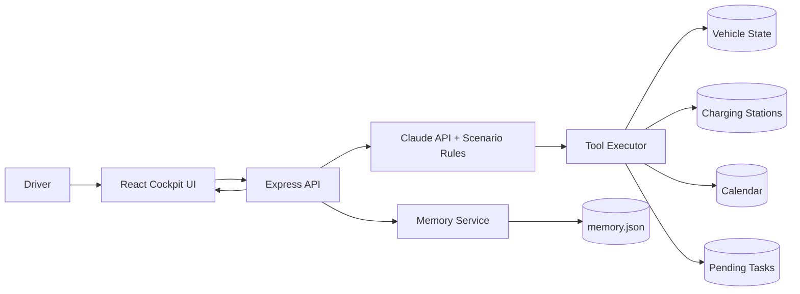

# ChargeFlow Agent

> A portfolio-ready intelligent cockpit charging agent with scenario reasoning, multi-tool orchestration, and cross-session memory.

ChargeFlow Agent is not a simple "low battery, find a charger" tool. It is an enterprise-grade cockpit task manager that reasons about **battery state, current trip, future schedule, and cross-session history** to make proactive charging decisions. The project demonstrates end-to-end product thinking, scenario modeling, prompt engineering, function-calling architecture, and full-stack prototyping.

## Core Scenarios

### Scenario A: No Destination — Proactive Charging
- **Trigger**: SOC below threshold (e.g. 18%), no active navigation, no urgent calendar events
- **Action**: Auto-search nearby stations, rank by distance/power/availability, recommend optimal station
- **Principle**: No trip constraints → charge immediately

### Scenario B: Mid-Navigation — Protect Current Trip
- **Trigger**: Navigation active, SOC may not support reaching destination or return
- **Action**: If sufficient → don't interrupt, flag latest safe charging window. If insufficient → reroute to nearest station
- **Principle**: Protect the current trip first, but lock down a charging deadline

### Scenario C: Upcoming Calendar Events — Future Trip Planning
- **Trigger**: No active navigation, but calendar has upcoming driving appointments
- **Action**: Calculate total trip chain distance vs. current range, compute "latest charging deadline"
- **Principle**: Look beyond current SOC — assess whether it threatens future commitments

### Scenario D: Cross-Session Continuity — Resume Unfinished Tasks
- **Trigger**: Previous session generated a charge recommendation that was not executed
- **Action**: Retrieve pending task, re-evaluate current conditions, present updated recommendation
- **Principle**: The agent never forgets an unfinished task

## Architecture



## Design Highlights
- **Scenario Decision Engine**: Four scenarios cover the full state space from "idle" to "mid-trip", with priority-ordered multi-tool orchestration
- **Five-Tool Orchestration**: vehicle_status / search_stations / calendar / pending_tasks / charge_plan work together via standard `tool_use` schema
- **Five-Layer Prompt**: role → scenario rules → tools → memory → constraints guides the LLM through structured decision-making
- **Cross-Session Memory**: Driver preferences persisted as JSON; unfinished tasks auto-resume in the next session
- **Vehicle Dashboard**: Real-time SOC, range, navigation state, and tool call trace visualization

## Quick Start

```bash
git clone <your-repo-url>
cd chargeflow-agent
npm install
cp .env.example .env
npm run dev:server
npm run dev:client
```

If `ANTHROPIC_API_KEY` is missing, the project falls back to mock mode so the demo still works.

- Frontend: <http://localhost:5173>
- Backend API: <http://localhost:3001>
- Note: the backend is an API-only service. Visiting `/` will show `Cannot GET /`, which is expected.

## Documentation
- [PRD (CN)](./docs/PRD.md)
- [Architecture](./docs/architecture.md)
- [Prompt Design](./docs/prompt-design.md)

## Future Improvements
- Real map API integration (Amap / Baidu / Google Maps) for routing and traffic
- Real-time charging station data feeds
- Multi-vehicle management
- Charging cost estimation and comparison
- Observability, evaluation, and replay tooling
- LLM-based memory extraction and summarization
