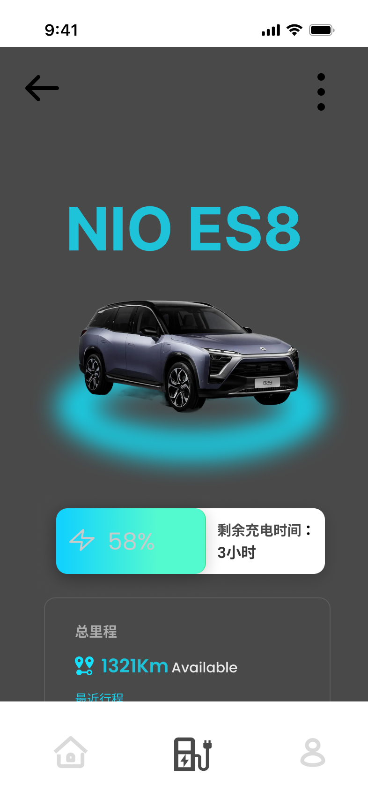
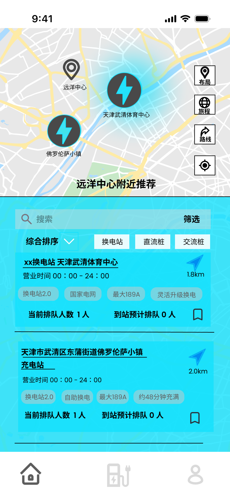
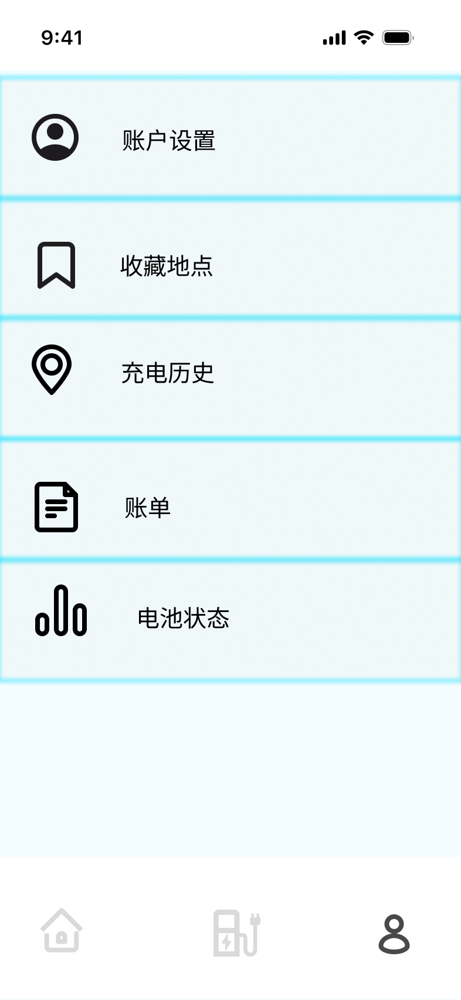

# 🎨 设计 → 实现 / Design to Implementation

> 这个项目从一份**移动端充电小程序**的产品设计出发,重新构想成一个 **AI Agent**。
> 本文记录原始设计、产品演进的思考,以及"设计稿 → 实现"的对照。

🔗 **原始交互原型(Figma)**:[电动车智能充电小程序](https://www.figma.com/proto/Lx9zKvPVRtMMtm7VvqeoWR/%E7%94%B5%E5%8A%A8%E8%BD%A6%E6%99%BA%E8%83%BD%E5%85%85%E7%94%B5%E5%B0%8F%E7%A8%8B%E5%BA%8F?node-id=105-758)

---

## 1. 产品演进 / The Pivot

| | 原始设计(Figma) | 现在的产品(本项目) |
| --- | --- | --- |
| **定位** | "找附近充电站"的工具型小程序 | 感知电量/行程/日程/记忆的 **AI 补能 Agent** |
| **交互** | 用户手动搜索、筛选、点选站点 | 用户用自然语言提问,Agent 主动推理 + 编排工具 |
| **智能** | 规则与列表 | Claude Function Calling + 分层 Prompt + 跨会话记忆 |
| **形态** | 手机小程序 | **一个大脑,两个表面**:手机端(获客/内测)+ 车机座舱(最终嵌入) |

**核心洞察**:原始设计已经把"找桩"这件事做得很完整(地图、列表、筛选、排队、扫码)。真正的升级空间不在 UI,而在**决策**——把"用户自己找"变成"Agent 替你判断现在/路上/未来要不要充、去哪充"。于是保留原设计的视觉语言与信息架构,把核心交互换成对话式 Agent。

---

## 2. 一个大脑,两个表面 / One Brain, Two Surfaces

```
                 ┌──────────────────────────────┐
   手机端 /m  ───▶│  Express API + Claude Agent   │◀───  车机座舱 /
 (获客 · 内测)     │  (Function Calling · Memory)  │   (最终嵌入形态)
                 └──────────────────────────────┘
```

- **手机端 `/m`(本次新增)**:照 Figma 视觉语言还原的移动小程序 + PWA,可扫码安装、零门槛,用于**拉用户内测、验证需求**。
- **车机座舱 `/`**:横屏仪表盘式 UI,对应产品的**最终嵌入车机**形态。
- 两个表面**复用同一套后端与 Agent 逻辑**(`useChat` + `/api`),只是渲染层不同。

---

## 3. 设计稿 → 实现对照 / Frame-by-Frame

### 车况 / 电量状态
原始设计用深色英雄页 + 车辆渲染 + 电量环;实现里换成实时车况(SOC 环、续航、导航)并接上 Agent CTA。

| 原始设计 | 实现 |
| --- | --- |
|  |  |

### 附近充电站
原始设计的站点卡片(营业时间、快充/换电标签、排队、距离)被直接复用为 **Agent 工具调用结果的渲染卡片**。

| 原始设计 | 实现 |
| --- | --- |
|  |  |

### 我的 / 记忆
原始"我的"菜单(账户/收藏/历史/账单/电池)之上,新增了 Agent 的**跨会话驾驶记忆**。

| 原始设计 | 实现 |
| --- | --- |
|  |  |

---

## 4. 视觉语言 / Design System

- **品牌色**:青/蓝绿渐变 `#22d3ee → #2dd4bf`(cyan → teal)
- **双模式**:浅色信息页(白底 + 描边卡片 + 彩色标签)/ 深色英雄页(车况、电量环发光)
- **导航**:底部三 Tab —— 车况 / 充电(中间高亮)/ 我的
- **组件**:圆角卡片、能力标签(快充/慢充/换电站)、iOS 状态栏

> 其余完整帧见 [`docs/figma/电动车智能充电小程序/`](./figma/)。
