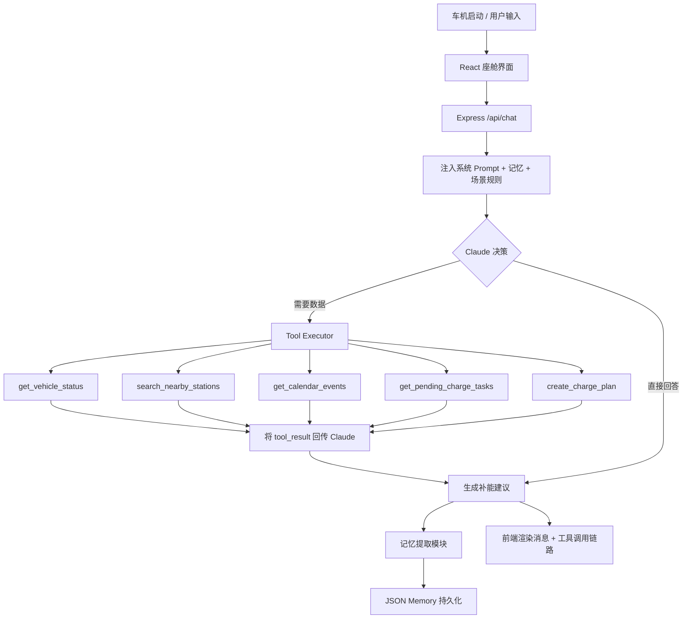

# ChargeFlow Agent 产品需求文档

## 1. 产品背景与目标
ChargeFlow Agent 是一个基于 LLM 的智能座舱补能决策 Agent，目标是展示从需求定义、场景建模、Prompt 设计、工具调用架构到前后端实现的企业级 Agent 能力。它不是简单的"电量低找桩"工具，而是一个能感知电量状态、当前任务、未来行程、跨时段记忆的**任务管家型 Agent**。

## 2. 用户画像
- **电动车车主**：需要一个能主动管理补能、不让充电焦虑影响出行的智能助手
- **求职中的 AI 产品/应用工程师**：通过一个企业级场景展示完整的 Agent 产品思维
- **面试官/技术评审**：快速理解候选人的场景建模、系统设计与工程决策能力

## 3. 核心场景

### 场景 A：无目的地、无紧急行程 — 主动补能
- **触发条件**：车机开启，SOC < 20%，无导航目的地，短期无高优日程
- **系统动作**：自动检索附近充电站，按距离/等待时间/可用桩数/充电效率生成最优方案
- **一句话逻辑**：没有行程约束时，优先立即补能

### 场景 B：导航途中 — 保障当前任务
- **触发条件**：用户正在导航，系统识别剩余电量可能影响到达或返程
- **系统动作**：
  - 若可支撑当前行程 → 不中断导航，提示最晚补能截止点
  - 若不足以到达目的地 → 立即重规划最近充电点
- **一句话逻辑**：导航途中优先保障当前任务，但提前锁定补能截止点

### 场景 C：有后续日程 — 预判未来出行
- **触发条件**：当前无导航，但日历中有后续需驾车的日程
- **系统动作**：基于日程时间、距离、路况、充电耗时计算"最晚补能时间"，建议空闲时段充电
- **一句话逻辑**：不只看当前电量，而是看是否影响后续履约

### 场景 D：跨时段续接 — 延续未完成任务
- **触发条件**：上一次系统已生成补能建议，用户未执行，下次上车时车机重启
- **系统动作**：读取未完成任务，重新评估当前条件，更新推荐
- **一句话逻辑**：Agent 具备跨时段记忆与续接能力，不是一次性提醒

## 4. 核心功能列表

### P0
- 车辆状态查询（SOC、续航、位置、导航状态）
- 附近充电站搜索（距离、功率、等待时间、可用桩数）
- 日历行程查询（评估补能紧迫性）
- 未完成任务续接
- 充电计划创建与持久化
- 工具调用链路可视化
- 跨会话记忆（驾驶偏好、充电习惯）

### P1
- 驾驶偏好记忆面板
- Claude API 缺失时的 mock 降级
- 提示词分层设计与文档化
- 车辆状态仪表盘

### P2
- 真实地图 API 集成（高德/百度/Google Maps）
- 实时充电站数据接入
- 多车辆管理
- 充电费用预估与比价

## 5. 交互流程图

## 6. 成功指标
- **场景覆盖率**：四大场景均可通过对话触发并正确响应
- **决策合理性**：充电建议考虑了距离、功率、等待时间、用户偏好
- **记忆命中率**：涉及用户偏好的场景中，Agent 成功利用记忆的比例 > 70%
- **跨会话续接**：未完成任务在下次会话中被正确恢复并更新

## 7. 核心升级点（相比简单找桩 App）
1. 电量状态识别
2. 当前任务判断
3. 未来任务预判
4. 最晚补能时点计算
5. 跨时段待办延续
6. 下一次触发时重新决策
