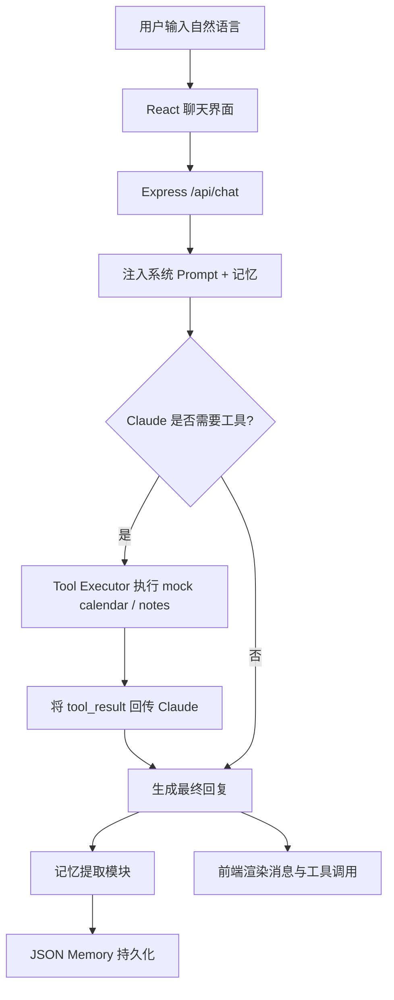

# ChargeFlow Agent 产品需求文档

## 1. 产品背景与目标
ChargeFlow Agent 是一个基于 LLM 的个人助手 Agent 原型，目标是在求职作品集中展示从需求定义、Prompt 设计、工具调用架构到前后端实现的一体化能力。它围绕“对话式任务执行”构建，聚焦于日历管理、知识检索、跨会话记忆三类典型 Agent 能力。

## 2. 用户画像
- **求职中的 AI 产品/应用工程师**：需要一个能展示完整产品能力的 demo
- **高频知识工作者**：通过自然语言管理日程与个人知识
- **面试官/技术评审**：快速理解候选人的系统设计与工程取舍

## 3. 核心功能列表

### P0
- 自然语言聊天界面
- 调用 `get_calendar_events` 查询日历
- 调用 `create_calendar_event` 创建日历事件
- 调用 `search_notes` 搜索知识库
- 跨会话记忆存储与注入
- 工具调用链路可视化

### P1
- 记忆侧边栏展示
- Claude API 缺失时的 mock 降级
- 提示词分层设计与文档化

### P2
- 用户记忆编辑/删除
- 支持更多工具（待办、邮件、提醒）
- 事件冲突检测和主动建议

## 4. 交互流程图

## 5. 成功指标
- **任务完成率**：用户意图被正确响应并完成的比例 > 85%
- **平均对话轮次**：完成日程查询/创建任务平均 <= 2.5 轮
- **记忆命中率**：涉及用户偏好的场景中，Agent 成功利用记忆的比例 > 70%
- **工具调用成功率**：后端 mock tool 执行成功率 > 95%
