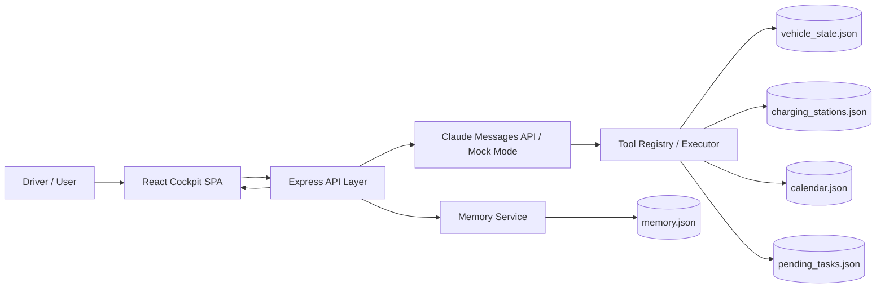

# ChargeFlow Agent 技术架构说明

## 1. 整体架构图



## 2. 请求生命周期
1. 用户在座舱界面输入消息（或车机启动自动触发）。
2. 前端将完整对话上下文提交到 `/api/chat`。
3. 后端读取 memory.json，将驾驶偏好注入系统 Prompt。
4. 系统 Prompt 包含四大场景规则，引导 Claude 做出正确决策。
5. Claude API 根据 Prompt 与 tool schema 决定调用哪些工具：
   - `get_vehicle_status` — 获取电量、续航、位置、导航状态
   - `search_nearby_stations` — 搜索附近充电站
   - `get_calendar_events` — 查询即将到来的行程
   - `get_pending_charge_tasks` — 检查未完成的充电任务
   - `create_charge_plan` — 创建充电计划
6. 工具结果以 `tool_result` 形式回传模型，生成最终补能建议。
7. Memory Service 从本轮对话中提取驾驶偏好/充电习惯，写入 memory.json。
8. 前端展示最终消息、工具调用轨迹、车辆状态和记忆面板。

## 3. 场景决策引擎

Agent 的核心不是单一工具调用，而是**多工具组合决策**：

| 场景 | 必须调用的工具 | 决策逻辑 |
|------|---------------|---------|
| A. 无目的地补能 | vehicle_status + search_stations | SOC < 阈值 + 无导航 → 推荐最优站点 |
| B. 导航途中 | vehicle_status + calendar(可选) | 判断续航 vs 剩余路程 → 继续 or 改道 |
| C. 有后续日程 | vehicle_status + calendar | 计算行程链路总距离 vs 续航 → 最晚补能时间 |
| D. 跨会话续接 | pending_tasks + vehicle_status + search_stations | 重新评估旧任务 → 更新推荐 |

## 4. 记忆系统设计

### 提取策略
- 启发式规则从用户文本中抽取充电偏好、驾驶习惯。
- 支持中英文模式匹配。

### 存储格式
```json
{
  "facts": [
    {
      "id": "mem-1",
      "type": "preference",
      "content": "User prefers Tesla Supercharger and NIO Power stations.",
      "source": "heuristic-extraction",
      "createdAt": "2026-04-06T12:00:00.000Z"
    }
  ],
  "lastUpdated": "2026-04-07T22:12:00.000Z"
}
```

### 注入方式
- 每次 `/api/chat` 前读取最近若干条 durable memory
- 以 `[type] content` 格式拼接进 system prompt 的 memory layer

## 5. 任务持久化

未完成的充电建议存储在 `pending_tasks.json`，包含：
- 推荐的充电站信息
- 创建时间、原因
- 用户操作状态（pending / dismissed / completed）
- `retryOnNextStart` 标志位

下次车机启动时，Agent 自动读取 pending tasks 并重新评估。

## 6. 错误处理与降级策略
- **Claude API Key 缺失**：自动启用 mock mode，保证 demo 仍可运行
- **工具调用失败**：返回结构化错误，避免前端崩溃
- **JSON 写入异常**：记录错误并继续返回主响应
- **参数校验失败**：通过 zod 返回明确的 bad request
