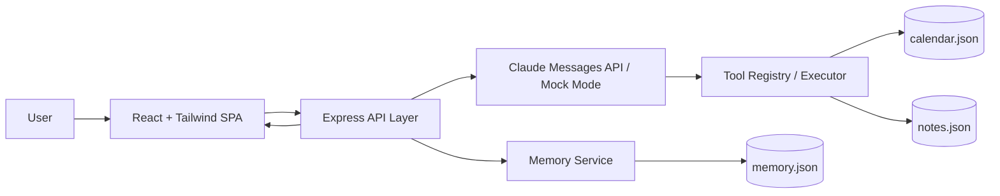

# ChargeFlow Agent 技术架构说明

## 1. 整体架构图



## 2. 请求生命周期
1. 用户在 React 界面输入消息。
2. 前端将完整对话上下文提交到 `/api/chat`。
3. 后端读取 memory.json，并将记忆内容注入系统 Prompt。
4. Claude API 根据 Prompt 与 tool schema 决定是否发起 `tool_use`。
5. Tool Executor 分发到对应工具实现：
   - `get_calendar_events`
   - `create_calendar_event`
   - `search_notes`
6. 工具结果以 `tool_result` 形式回传模型生成最终回答。
7. Memory Service 从本轮对话中提取偏好/事实，并写入 memory.json。
8. 前端展示最终消息、工具调用轨迹与更新后的记忆面板。

## 3. 记忆系统设计
### 提取策略
- 默认采用启发式规则，从用户或助手文本中抽取偏好、习惯、约束。
- 无 API Key 时，仍保留记忆提取能力。

### 存储格式
```json
{
  "facts": [
    {
      "id": "mem-1",
      "type": "preference",
      "content": "User usually avoids meetings on Wednesday afternoons.",
      "source": "heuristic-extraction",
      "createdAt": "2026-04-07T12:00:00.000Z"
    }
  ],
  "lastUpdated": "2026-04-07T12:00:00.000Z"
}
```

### 注入方式
- 每次 `/api/chat` 前读取最近若干条 durable memory
- 以 bullet list 形式拼接进 system prompt 的 memory layer

## 4. 错误处理与降级策略
- **Claude API Key 缺失**：自动启用 mock mode，保证 demo 仍可运行
- **工具调用失败**：返回结构化错误，避免前端崩溃
- **JSON 写入异常**：记录错误并继续返回主响应
- **参数校验失败**：通过 zod 返回明确的 bad request
